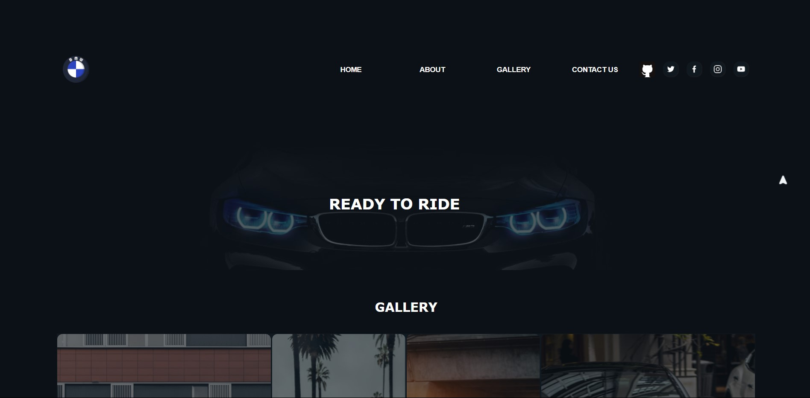
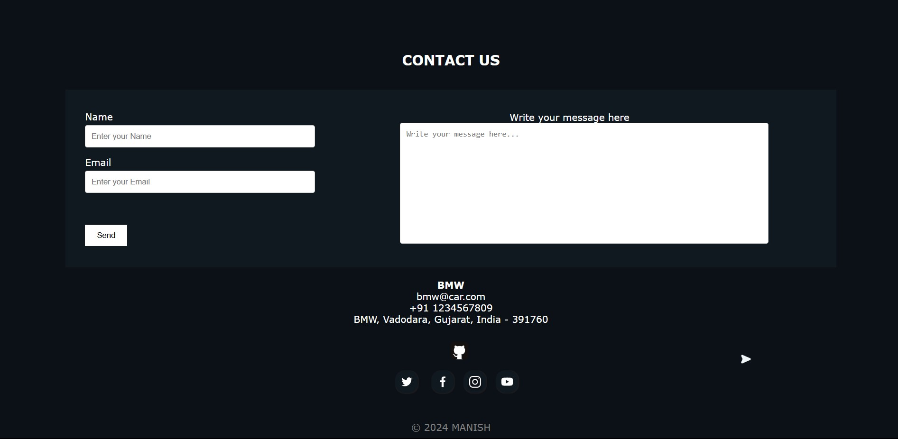

# 🚗 BMW Landing Page

A modern, responsive **landing page for BMW** built using **HTML**, **CSS**, and **JavaScript**.  
This project highlights sleek UI design, smooth animations, and interactive user elements.

> 🌐 Live Demo: [bmwx55.vercel.app](https://bmwx55.vercel.app)


---

## 📸 Screenshots

### 🔹 Home Page


### 🔹 Contact Us Section



---

## ✨ Features

- 🚀 **Modern UI** with clean layout and branding
- 🎯 **Smooth Animations** for enhanced UX
- 🔝 **Click-to-Top Button** for better navigation
- 🖱️ **Custom Cursor** styling for a unique experience
- 📩 **Contact Form** powered by [Web3Forms](https://web3forms.com)
- 📱 **Responsive Design** across all screen sizes
- 🌐 **Deployed on Vercel**

---

## 🛠️ Tech Stack

- **HTML5** – Page structure
- **CSS3** – Styling and responsive design
- **JavaScript** – DOM interactions, scroll-to-top functionality
- **Web3Forms** – For backend-less contact form submissions
- **Vercel** – Deployment platform

---

## 🚀 Getting Started

To run this project locally:

```bash
git clone https://github.com/Manish-Let-It-Be/BMW_Page.git
cd BMW_Page
open index.html
```

Or simply open `index.html` in your browser.

---

## 📬 Contact

Want to connect or have feedback?

- GitHub: [Manish-Let-It-Be](https://github.com/Manish-Let-It-Be)
- Live Project: [bmwx55.vercel.app](https://bmwx55.vercel.app)

---


<p align="center">
  
</p>
