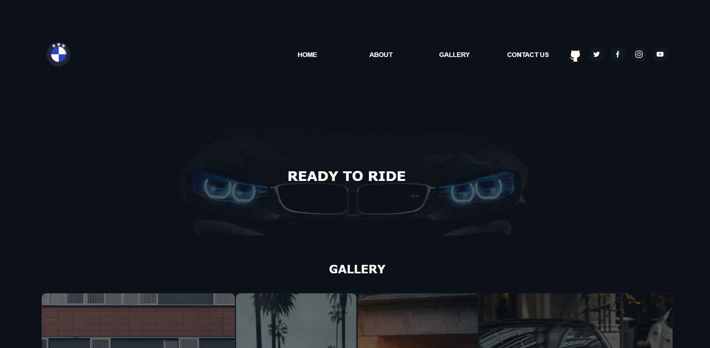

# BMW Car Webpage 🚗

## Overview

This project is a simple webpage showcasing BMW cars. It includes interactive header buttons with animations, built using HTML, CSS, and JavaScript. The goal of this project is to demonstrate basic web development skills.

## Features

- **Responsive Design**: The webpage is designed to be mobile-friendly.
- **Clickable Header Buttons**: Buttons in the header navigate to different sections and have smooth animations.
- **Interactive Elements**: Includes a "Scroll to Top" button for easy navigation.
- **Basic Animation**: Simple CSS animations enhance the user experience.

## Technologies Used

- **HTML**: Structure of the webpage.
- **CSS**: Styling and layout.
- **JavaScript**: Interactivity and animations.

## Getting Started

### Prerequisites

- A web browser (Chrome, Firefox, etc.)
- A text editor (VSCode, Sublime Text, etc.)

### Installation

1. **Clone the repository**:
   ```bash
   git clone https://github.com/Manish-Let-It-Be/BMW_Page
   ```
2. **Navigate to the project directory**:
   ```bash
   cd bmw-car-webpage
   ```
3. **Open the `Web.html` file in your web browser** to view the project.

## Screenshot

Here is the screenshot of the webpage:


**Screenshot of the homepage*


## Contributing

Feel free to fork the repository and submit pull requests for any improvements or features you'd like to add!


